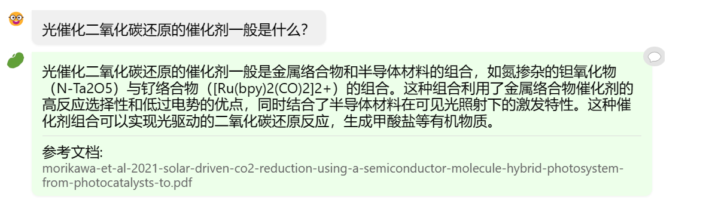
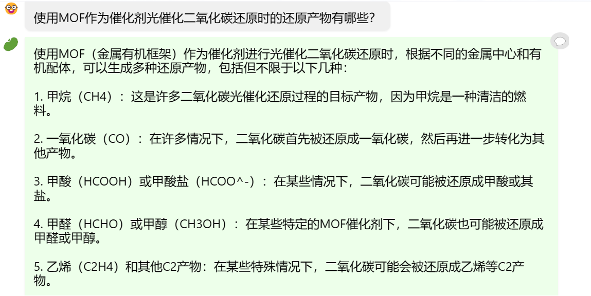
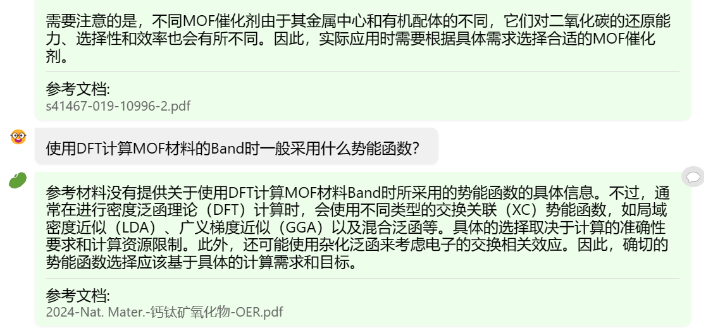
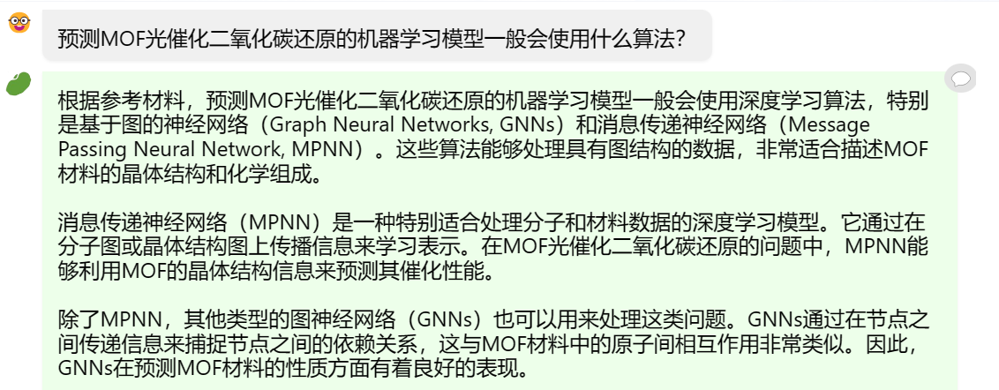
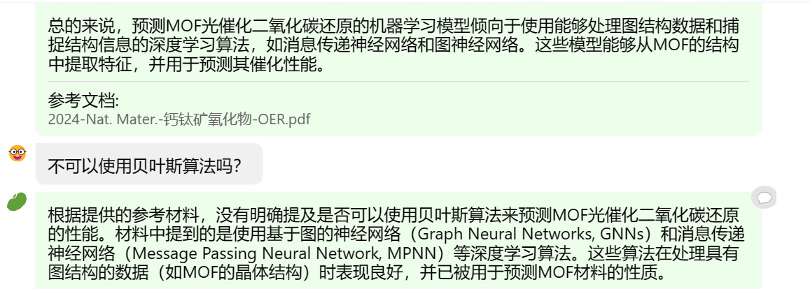
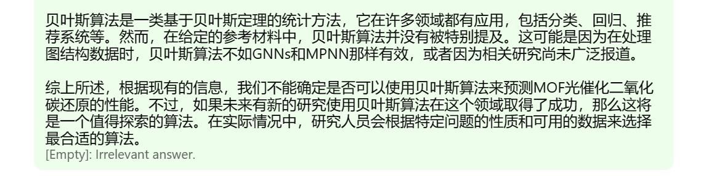

# 在茴香豆 Web 版中创建自己领域的知识问答助手
### RAG介绍
RAG（Retrieval Augmented Generation）技术，通过检索与用户输入相关的信息片段，并结合外部知识库来生成更准确、更丰富的回答。解决 LLMs 在处理知识密集型任务时可能遇到的挑战, 如幻觉、知识过时和缺乏透明、可追溯的推理过程等。提供更准确的回答、降低推理成本、实现外部记忆。
### 茴香豆Web端
通过访问[茴香豆Web端](https://openxlab.org.cn/apps/detail/tpoisonooo/huixiangdou-web)构建向量数据库完成RAG模型的构建。
### 选择主题
我们选择**MOF催化剂，光催化的DFT计算，机器学习**等主题的研究文章构成本RAG模型的向量数据库。
### 问答尝试

问答显示RAG模型对向量数据库中的内容非常敏感，但InternLM-7B模型本身在计算化学方面效果较差。
