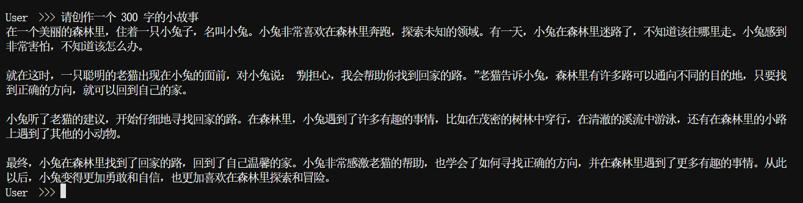
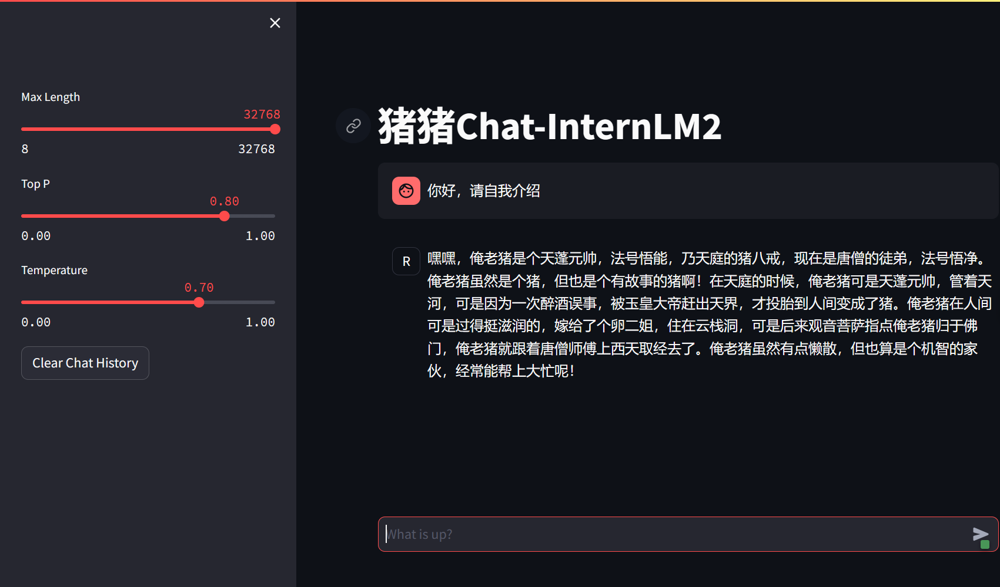
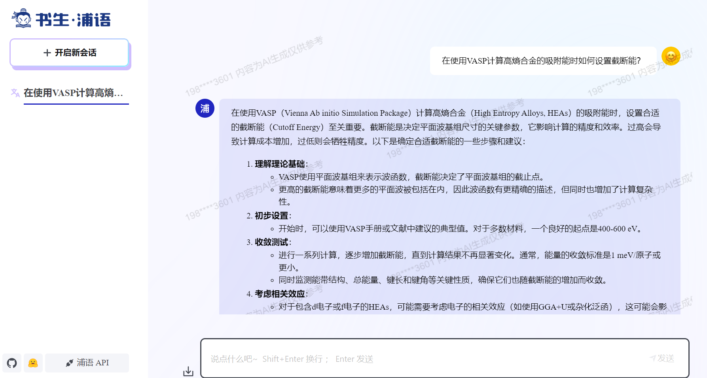

# 1 部署InternLM2-Chat-1.8B 模型进行智能对话
通过在InternLM平台上创建开发机，并使用该开发机部署InternLM2-Chat-1.8B模型，实现智能对话。
在创建开发机后键入以下代码以创建demo环境
```bash
studio-conda -o internlm-base -t demo
```

按教程处理后完成对话。

# 部署实战营优秀作品 八戒-Chat-1.8B 模型

# 使用书生·浦语 Web 和浦语对话

在使用书生浦语大模型后发现 1 处表现不佳的案例：
在计算化学领域出现诸多错误，并且无法从外部导入文件。

